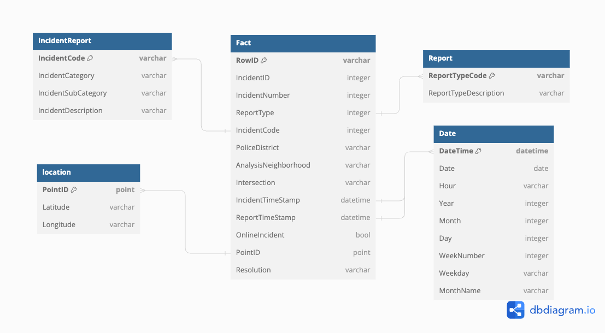

# An analytics on the Sanfrancisco Crimes

This project gives insight on crimes registered in San Francisco. Th source for this data id from the SF government website.

[Sanfrancisco Crimes Data](https://data.sfgov.org/Public-Safety/Police-Department-Incident-Reports-2018-to-Present/wg3w-h783)

## Database Design

The following will be fact and dimension tables based on Raw data.

## Architecture Design

I am using ETL pipelines with Airflow, DBT and python to store data into data warehouse (Bigquery)

